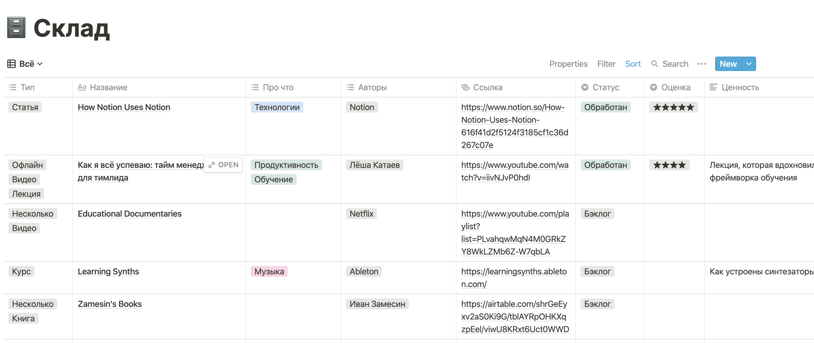
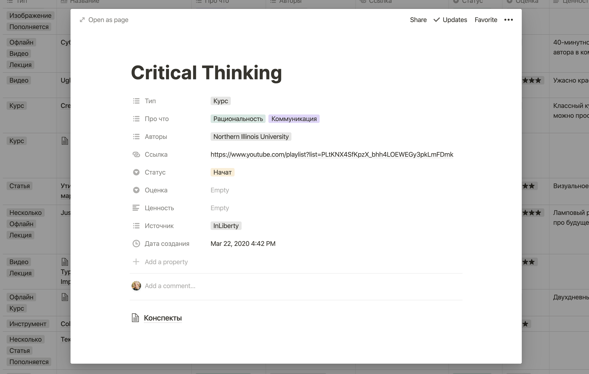
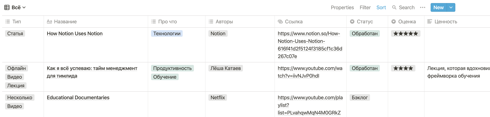
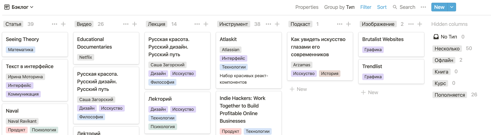
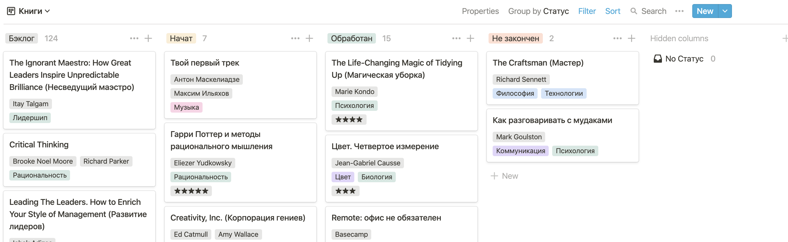
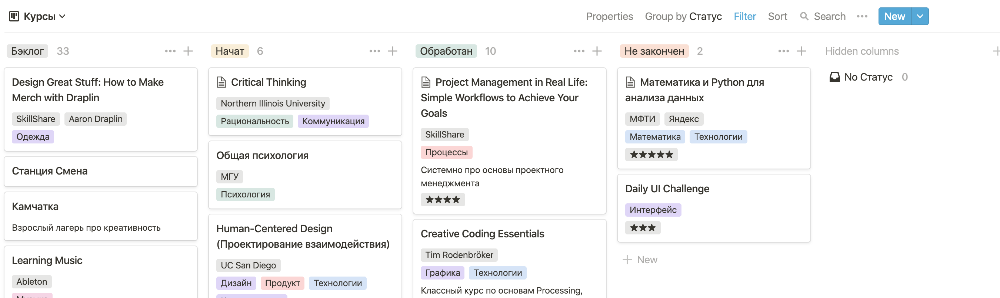
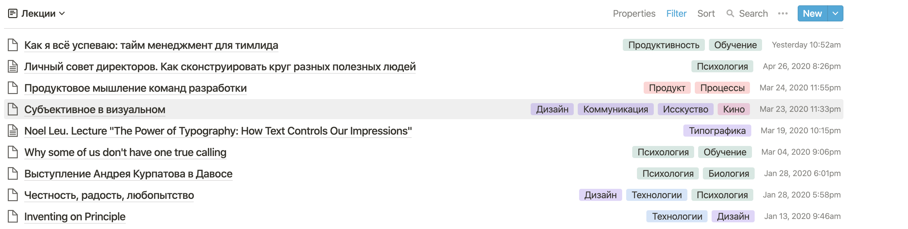
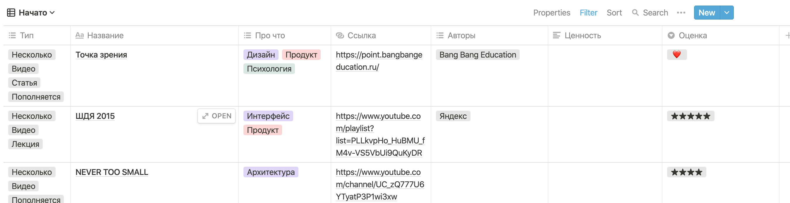
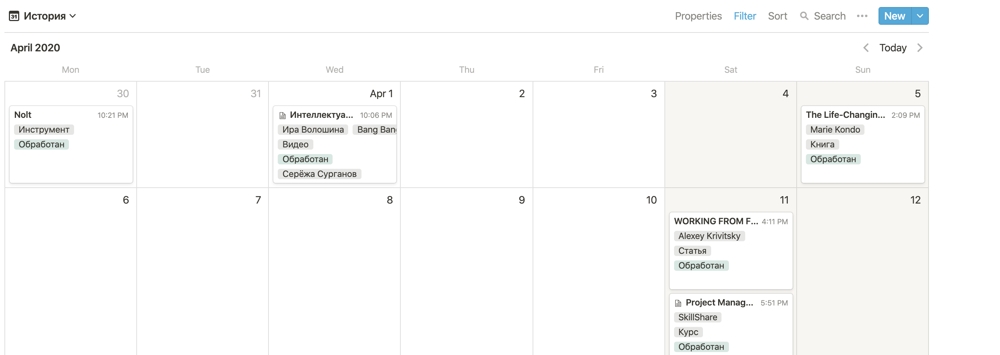

Начал упорядочивать потребление контента с помощью [Notion](https://www.notion.so/?r=28a0cf6a73154f62949a91461fb19a7a) и собрал в нём [Склад](https://www.notion.so/28f3b77336bb48e5b1e97aaf1dd6a3b2?v=d99523701d0f42f8aec5f98c75381bda) — систему для обучения. Получился гибкий, но простой в обращении инструмент. Моя система вдохновлена фреймворками других ребят, но мне подошла лучше остальных. Рассказываю о системе, её плюсах и минусах, чтобы вы тоже могли вдохновиться и собрать свою.

---

Я трачу много времени на потребление. Читаю книжки, статьи, блоги, рассылки и телеграм-каналы. Смотрю видео и лекции. Слушаю подкасты. Прохожу курсы. Иногда даже в офлайне. До недавнего времени делал всё это неосознанно.

Иногда я отправлял материал на кладбище в Pocket, в забитые «Сохранённые сообщения» Телеграма или список «Смотреть позже» в Ютубе. Это не помогало. Было сложно найти что-то, когда оно было нужно. Так же как и вспомнить, что посмотрел, а что нет. Любая попытка поделиться инструментом или статьёй превращалась в «ну там была какая-то штука, где было про что-то такое».

Голова добавляла сложностей. Наша память работает так, что мы плохо запоминаем то, что видели один раз. Чтобы информация усвоилась, её [нужно вспоминать несколько раз](https://www.gwern.net/Spaced-repetition) через разные интервалы времени. И это было нереально сделать. Я не помнил, что проходило через меня, и тем более когда. Получается, много времени тратил впустую. Смотрел в прошлое и с трудом понимал, что я вообще делал.

## Как решал проблему

Я экспериментировал с многими инструментами. Перепробовал несколько таск-трекеров, которые не были приспособлены к работе с большими открытыми списками. Завёл Покет, в который теперь боюсь заглядывать. Создал закрытые телеграм-каналы для себя и до сих пор пользуюсь там «Сохранёнными». Давно веду в Google Keep быстрые заметки.

Полтора года назад я узнал о Ноушене. Распробовал его на нескольких проектах и понял, что на нём можно собрать операционную систему для себя.

Через несколько месяцев я услышал [рассказ](https://www.youtube.com/watch?v=iivNJvP0hdI) Лёши Катаева о том, как он собрал свой фреймворк для обучения. Лёша использовал Эксель и Трелло. Я попробовал сделать всё в Ноушене. Так у меня появилась канбан-доска для книг, ещё одна для курсов, таблица с закладками. Инструментов было много, но они хотя бы лежали рядом.

Со временем мне надоело поддерживать несколько похожих инструментов, поэтому я попробовал собрать всё в один. На первый взгляд, система получилась сложная, но её просто использовать и обслуживать. Это то, для чего Ноушен подходит лучше всего — построения сложных, но удобных систем. Можно использовать его как простой заметочник, но весь кайф раскрывается, когда строишь свои инструменты.

Ноушен выглядит чисто и минималистично, но внутри это комбайн с множеством настроек. Из-за этого тяжело с первого раза разобраться во всём. Команда проекта вместе с пользователями собирает [библиотеку шаблонов](https://www.notion.so/Notion-Template-Gallery-181e961aeb5c4ee6915307c0dfd5156d). Готовые рецепты помогают понять, для чего подходит инструмент. Поэтому делюсь своим. Полгода назад я тоже увидел шаблон Reading List, и звёзды сложились.

## Что получилось

[Склад](https://www.notion.so/28f3b77336bb48e5b1e97aaf1dd6a3b2?v=d99523701d0f42f8aec5f98c75381bda) — это база всего, что увидел, услышал или прочитал. Я складываю туда только то, что зацепило, что не хочу потерять. Фактически, это приложение для удобного сохранения материалов. Склад может быть таблицей из строк и колонок. Материал — строка — описывается набором свойств — колонок. Расскажу подробнее.

**Название.** Главное свойство строки. Использую названия, по которым будет легко найти материал. Например, для книги пишу название в оригинале и русский перевод в скобках.

**Тип.** Есть у каждой строки. Стараюсь не раздувать список и держать только базовые типы. У каждого такой набор свой. У меня: статья, видео, книга, изображение, лекция, курс, инструмент или подкаст. Хотя могут быть и рецепты, стихи или музыка.

Помимо базовых, есть служебные типы. Для обозначения подборок завёл мета-тип «несколько». Плейлист на ютубе — «несколько, «видео». Подборка книг — «несколько», «книга». Сайт шрифтовой мастерской — «несколько», «инструмент». То, что видел лично, помечаю типом «офлайн». Для пополняющихся ресурсов использую тип «пополняется». Блог — это «несколько», «статья», «пополняется». Такие модификаторы позволяют не заводить новый тип для рассылки, инстаграм-аккаунта или новостного сайта.

**О чём.** Набор моих интересов. Например, дизайн, продукт, технологии, психология, музыка. Смежные темы крашу в один цвет.

**Авторы.** Колонка с самым большим количеством вариантов. Пишу нерусские имена латиницей, чтобы не дублировать одинаковых авторов в разной транслитерации. Даже если это Mihaly Csikszentmihalyi.

**Ссылка.** Может быть только одна. Она кликабельная. Если ссылок несколько, можно положить остальные внутрь материала.

**Статус.** Свойство, по которому можно понять, что произошло с материалом. Четыре значения: «бэклог» — посмотрю это потом, «начат» — уже в процессе, «обработан» — просмотрел, «не закончен» — не зашло. Раньше статусов было больше, но здесь простота важнее гибкости.

**Оценка.** Ставлю, чтобы запомнить впечатление. Сейчас это до пяти звёздочек или сердечко. По количеству оценок можно считать, какой процент добавленных материалов обработал.

**Ценность.** Формулирую в паре предложений. Помогает вспомнить, почему меня вообще это интересовало, если другие свойства не помогают.

**Источник.** Ещё одно свойство, которое помогает восстановить контекст. Это человек или ресурс, через который я узнал о материале. Источник позволяет отслеживать следы и понимать, какие каналы полезнее других. Ваня Замесин [в таблице с книгами](https://airtable.com/shrGeEyxv2aS0Ki9G/tblAYRpOHKXqzpEel/viwU8KRxt6Uct0WWD) использует источники для скоринга, какие книжки прочитать раньше других.

### Что внутри

Каждая строка — это страница. Я кладу туда выжимку статьи, конспект лекции, файл или ссылку. Но чаще оставляю её пустой. На странице доступны все возможности Ноушена. Это может быть абзац текста или ещё одна база данных. Например, для курсов часто создаю внутри список записей по лекциям.

### Представления

Разные представления Склада — главная функция, которая помогает легко управляться со сложной системой. По сути, это возможность смотреть на материалы под разными углами. Я могу открыть Склад как привычную таблицу. Могу сгруппировать строки по значению в колонке — теперь это канбан-доска. Могу завязаться на поле с датой и разложить материалы по календарю. Могу использовать простой список, если нужна только пара свойств. Представления можно фильтровать, сортировать и отображать как захочется. Где-то тут все окончательно путаются. Разберём на примерах.

**Всё**

Обычно я добавляю, смотрю и правлю данные в представлении таблицы. Тут есть все строки и все колонки.

**Бэклог**

Доска с тем, что я хочу посмотреть. Тут всё, кроме долговременных начинаний: курсы и книжки на отдельных досках. Группировка по типу позволяет легко выбрать статью или видео, если хочу чего-то конкретного. Колонки «несколько», «офлайн» и «пополняется» спрятаны.

**Книги**

Доска с группировкой по статусам, на которой есть только книги. В карточке название, авторы, о чём и оценка. Удобно смотреть, что начал читать или что прочитал за какой-то период. В книжном часто открываю колонку с бэклогом, чтобы выбрать, что купить. Не хватает сортировки по рекомендациям — пока вверху последняя добавленная книжка.

**Курсы**

Выглядит и работает так же, как доска с книгами. Удобно открывать карточки с конспектами из колонки начатых.

**Лекции**

Простой список с лекциями. Внутри конспекты. Отображается название, о чём и дата.

**Начато**

Таблица с тем, что начал смотреть. Тут всё, кроме книг и курсов.

**История**

Календарь с материалами, которые привязаны по дню создания. Позволяет смотреть, что делал в прошедшую неделю, месяц, год. Я не всегда добавляю материал в момент просмотра, но для общей картины этого хватает.

У Склада семь представлений, но я часто использую другие. За несколько секунд можно накликать подборку по теме или автору. Посмотреть всё, чему поставил сердечко, или увидеть распределение, какие оценки обычно ставлю. Такая гибкость — вау-фича Ноушена.

## Что ещё

Есть мелочи, за которые я особенно люблю этот инструмент. Они делают использование не только удобным, но и приятным.

### Это красиво

Ноушен делает сильная команда дизайнеров. Им удалось собрать суперкомбайн с безумным количеством функций. При этом он выглядит сдержанно и спокойно, а интерфейс не напоминает продукты Microsoft Office 2013. Прямо сейчас я пишу черновик этой заметки. Когда печатаю, с экрана пропадает всё, кроме текста. В таких деталях весь кайф.

### Быстрый поиск

Я складываю материалы так, чтобы их было легко найти. Для этого пишу названия в оригинале, оставляю общепринятый перевод и оригинальные имена авторов. Вверху любого представления есть поиск, через который можно быстро найти материалы с нужным названием, типом или автором.

### Веб-клиппер

У Ноушена есть удобный веб-клиппер. Можно в два клика сохранить любую страницу на Склад. Даже с телефона. Сохраняется название страницы и ссылка. Работает почти как Покет, только нужно не забыть зайти на Склад, чтобы выставить остальные свойства последним сохранённым.

### Выгрузка в разных форматах

Ноушен сейчас стоит $2 млрд, и у компании всё хорошо. Но именно эта фича позволяет мне жить спокойно, ведь я могу в любой момент выгрузить Склад в Markdown и CSV. Так же как и загрузить его обратно в Ноушен. Есть возможность выгрузить ограниченную версию в виде HTML-страницы.

## Проблемы

Склад не идеален. Есть недостатки, которые ломают некоторые сценарии. О них стоит сказать отдельно.

### Медленное приложение для телефона

Тяжеловесность Ноушена иногда не даёт делать что-то на лету. Если нужно сделать быструю заметку в телефоне, я не буду смотреть на экран загрузки Ноушена. Вместо этого запишу её в Кип или Телеграм. Но команда работает над оптимизацией и часто выкатывает обновления: недавно мобильное приложение стало открываться за две-три секунды, хотя раньше висело все десять.

### Неудобно хранить медиа

Получившаяся система хорошо подходит для хранения текста: ссылок, конспектов, текстов, информации о материалах. Для неструктурированного медиа подходит хуже. Можно положить изображение или аудиозапись внутрь страницы, даже включить представление-галерею. Но добавлять тип, автора, тему и все свойства для каждой красивой картинки быстро надоест. Нужно подбирать инструмент под задачу, и изображения копить в [Are.na](http://are.na).

### Нет автоматизации

На момент написания заметки Ноушен нельзя автоматизировать — всё приходится делать руками. Хотя команда давно обещает открытое API и интеграцию с Zapier. Из-за этого некоторые материалы удобнее хранить там, где они используются. Фильмы и оценки — в Кинопоиске, книжки и отзывы — в Букмейте, видео — на Ютубе.

---

Склад — это только пример того, как можно организовать потребление. Кому-то она не подойдёт, зато подойдёт другая. Пробуйте и делайте потребление осознанным. Шаблон можно найти [здесь](https://www.notion.so/28f3b77336bb48e5b1e97aaf1dd6a3b2?v=d99523701d0f42f8aec5f98c75381bda), кнопка «Duplicate» — справа вверху.
